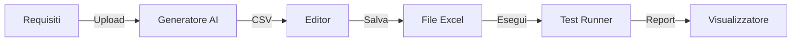

# 🤖 AI Test Automation Framework

<div align="center">

**Framework unificato di test automation powered by AI**  
Supporto completo per test **Mobile** (iOS/Android) e **Web** (Browser)

[](https://www.python.org/downloads/)
[](LICENSE)
[](http://appium.io/)
[](https://github.com/browser-use/browser-use)
[](https://github.com/app-use/app-use)

</div>

---

## ✨ Caratteristiche Principali

<table>
<tr>
<td width="50%">

### 🎨 Interfaccia Web Completa
- **Home Dashboard** intuitiva
- **Editor Visuale** per test case
- **Generatore AI** integrato
- **Esecuzione in tempo reale**
- **Report interattivi**

</td>
<td width="50%">

### 🚀 Testing Avanzato
- **Test Mobile** iOS & Android
- **Test Web** multi-browser
- **Cloud Testing** con LambdaTest
- **Log in tempo reale**
- **Screenshot automatici**

</td>
</tr>
</table>

---

## 📸 Screenshots

```
┌─────────────────────────────────────────────┐
│  🏠 Home  →  📝 Editor  →  🤖 Generator     │
│            ↓                                 │
│         ▶️ Execute  →  📊 Reports           │
└─────────────────────────────────────────────┘
```

---

## 🎯 Quick Start

### 1️⃣ Setup Ambiente

```bash
# Clona il repository
git clone https://github.com/yourusername/aitestautomation.git
cd aitestautomation

# Crea e attiva ambiente virtuale
python -m venv .venv

# Windows
.venv\Scripts\activate

# Mac/Linux
source .venv/bin/activate

# Installa dipendenze
pip install -r requirements.txt
```

### 2️⃣ Configura API Keys

Crea un file `.env` nella root del progetto:

```bash
# Gemini (Raccomandato - Free Tier disponibile)
GOOGLE_API_KEY=your_google_api_key_here

# Opzionale: Altri provider
# OPENAI_API_KEY=your_openai_key
# OLLAMA_BASE_URL=http://localhost:11434

# Configurazione LLM
WEB_LLM_PROVIDER=gemini  # Opzioni: gemini, openai, ollama
```

### 3️⃣ Installa Driver (per test mobile/web)

```bash
# Browser automation
playwright install chromium --with-deps

# Mobile automation (se necessario)
npm install -g appium
appium driver install uiautomator2  # Android
appium driver install xcuitest      # iOS (solo su Mac)
```

### 4️⃣ Avvia il Framework! 🎉

```bash
python web_editor.py
```

Il browser si aprirà automaticamente su `http://127.0.0.1:5000`

---

## 🎨 Interfaccia Web

### 🏠 Home Dashboard
Punto di partenza per tutte le operazioni:
- **Editor Test Case**: Gestisci i tuoi test
- **Genera Test Case**: Crea test con l'AI
- **Vedi Report**: Analizza le esecuzioni

### 📝 Editor Test Case (`/editor`)

| Feature | Descrizione |
|---------|-------------|
| **Gestione File** | Carica, crea, e seleziona file Excel |
| **Modifica Live** | Click su cella per editing immediato |
| **Toggle Active** | Checkbox per abilitare/disabilitare test |
| **Aggiungi/Rimuovi** | Icone intuitive per gestire righe |
| **Esecuzione** | Avvia test con log in tempo reale |
| **Stop Immediato** | Interrompi esecuzione in qualsiasi momento |

### 🤖 Generatore AI (`/generate`)

```
1. Carica file requisiti   →  2. Seleziona prompt
                ↓
3. Clicca "Genera"  →  4. Monitora progresso
                ↓
5. Scarica CSV      →  6. Importa nell'editor
```

**Features**:
- Log in tempo reale della generazione
- Interruzione sicura del processo
- Export diretto in formato CSV
- Memorizzazione ultimo prompt usato

### 📊 Report Viewer (`/reports`)
- Lista cronologica di tutte le esecuzioni
- Apertura diretta dei report HTML
- Eliminazione report obsoleti
- Filtri e ricerca integrati

---

## 📁 Struttura Progetto

```
aitestautomation/
│
├── 🚀 CORE
│   ├── web_editor.py           # ⭐ Entry point principale
│   ├── main_runner.py          # Test execution engine
│   ├── dati_test.xlsx          # Template file Excel
│   ├── .env                    # Configurazione (gitignored)
│   └── requirements.txt        # Dipendenze Python
│
├── 🎨 FRONTEND
│   └── templates/
│       ├── home.html           # Dashboard principale
│       ├── index.html          # Editor test case
│       ├── generate_tests.html # Generatore AI
│       └── reports.html        # Viewer report
│
├── 🧪 TEST ENGINE
│   └── tests/
│       ├── test_generator.py       # AI test generation
│       ├── mobile_test_executor.py # Mobile automation
│       └── web_test_executor.py    # Web automation
│
├── 🛠️ UTILITIES
│   └── utilities/
│       ├── excel_utils.py      # Excel I/O operations
│       ├── report_utils.py     # HTML report generation
│       └── ...                 # Altri helper
│
├── 📊 OUTPUT
│   ├── reports/unified/        # Report HTML generati
│   └── screen/                 # Screenshot test failures
│
└── 📚 DOCS
    └── docs/                   # Documentazione aggiuntiva
```

---

## 📋 Requisiti Sistema

### Software Necessario

| Component | Versione | Scopo |
|-----------|----------|-------|
| **Python** | 3.11+ | Runtime principale |
| **Node.js** | Latest LTS | Appium Server |
| **Chromium** | Latest | Web testing |
| **Appium** | 2.0+ | Mobile testing |

### File Excel - Struttura Colonne

```
TestID | Descrizione | Task | Active | Device | Execution | Platform
DeviceName | UDID | AppID | AppPackage | AppActivity
```

> 💡 **Tip**: L'editor web crea automaticamente la struttura corretta!

---

## 🎓 Guida d'Uso

### Workflow Tipico



### Esempio: Creare un Test da Zero

1. **Genera con AI**:
   - Vai su "Genera Test Case"
   - Carica `requisiti.txt`
   - Seleziona `prompt_costruisci_test.txt`
   - Click "Genera" e attendi

2. **Modifica nell'Editor**:
   - Apri il CSV generato
   - Affina le descrizioni
   - Imposta `Active=TRUE`

3. **Esegui**:
   - Click "Avvia Test"
   - Monitora log in tempo reale
   - Controlla screenshot in caso di errori

4. **Analizza Report**:
   - Vai su "Vedi Report"
   - Apri il report HTML
   - Analizza metriche e failures

---

## 🔧 Troubleshooting

<details>
<summary><b>❌ ModuleNotFoundError: No module named 'pandas'</b></summary>

**Causa**: Ambiente virtuale non attivo

**Soluzione**:
```bash
# Windows
.venv\Scripts\activate

# Mac/Linux
source .venv/bin/activate

pip install -r requirements.txt
python web_editor.py
```
</details>

<details>
<summary><b>❌ TemplateNotFound: home.html</b></summary>

**Causa**: File HTML non trovati

**Soluzione**:
Verifica che la cartella `templates/` esista allo stesso livello di `web_editor.py` e contenga tutti i file HTML.
</details>

<details>
<summary><b>❌ Cache browser non aggiorna l'interfaccia</b></summary>

**Soluzione**:
```
1. Hard Refresh: Ctrl+Shift+R (Windows) / Cmd+Shift+R (Mac)
2. Oppure: Apri finestra in incognito
3. Oppure: Svuota cache browser
```
</details>

<details>
<summary><b>❌ UnicodeEncodeError su Windows</b></summary>

**Soluzione**:
```bash
# Opzione 1: Avvia con UTF-8
python -X utf8 web_editor.py

# Opzione 2: Rimuovi emoji dai file .py
# (cerca caratteri come ✅ 🚀 nei file config_manager.py, main_runner.py)
```
</details>

<details>
<summary><b>❌ Appium non trova il device</b></summary>

**Soluzione Android**:
```bash
# Verifica dispositivo connesso
adb devices

# Abilita Developer Options + USB Debugging sul device
```

**Soluzione iOS**:
```bash
# Installa ios-deploy
npm install -g ios-deploy

# Verifica dispositivo
idevice_id -l
```
</details>

---

## 🤝 Contribuire

Contributi benvenuti! Per contribuire:

1. Fork del repository
2. Crea un branch (`git checkout -b feature/AmazingFeature`)
3. Commit delle modifiche (`git commit -m 'Add AmazingFeature'`)
4. Push del branch (`git push origin feature/AmazingFeature`)
5. Apri una Pull Request

---

## 📚 Risorse

- 📖 **Documentazione Completa**: Vedi cartella [`docs/`](docs/)
- 🎥 **Video Tutorial**: [Coming Soon]
- 💬 **Community**: [Discord/Slack Link]
- 🐛 **Bug Reports**: [GitHub Issues](https://github.com/yourusername/aitestautomation/issues)

---

## 🛠️ Stack Tecnologico

| Categoria | Tecnologie |
|-----------|------------|
| **Backend** | Python, Flask |
| **Testing** | Appium, Playwright, Browser-Use |
| **AI/ML** | LangChain, Google Gemini, OpenAI |
| **Data** | Pandas, Excel |
| **Frontend** | Bootstrap 5, JavaScript |
| **Cloud** | LambdaTest Integration |

---

## 📄 Licenza

Questo progetto è rilasciato sotto licenza **MIT License** - vedi il file [LICENSE](LICENSE) per dettagli.

---

## 🙏 Ringraziamenti

Un grazie speciale a:

- [**Browser-Use**](https://github.com/browser-use/browser-use) - Web automation framework
- [**App-Use**](https://github.com/app-use/app-use) - Mobile automation utilities
- [**Appium**](https://appium.io/) - Cross-platform mobile testing
- [**Flask**](https://flask.palletsprojects.com/) - Web framework
- [**Pandas**](https://pandas.pydata.org/) - Data manipulation
- [**LangChain**](https://www.langchain.com/) - AI orchestration

---

<div align="center">

### Made with ❤️ by [Pasquale Delli Bergoli](mailto:pasquale.dellibergoli91@gmail.com)

[](https://github.com/yourusername)
[](https://linkedin.com/in/yourprofile)

**⭐ Se ti piace questo progetto, lascia una star!**

</div>